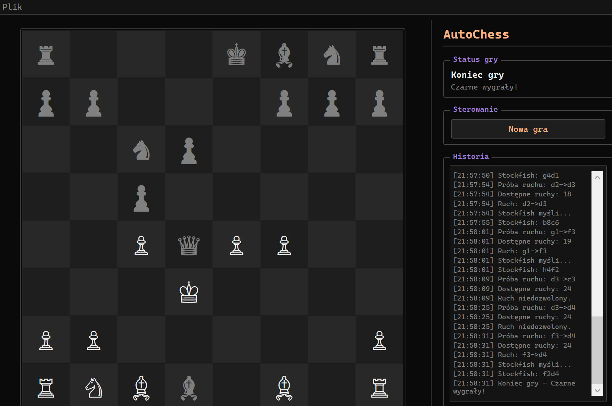

# AutoChess

Aplikacja WPF (.NET 10) pozwalająca na grę z silnikiem Stockfish.

## Uruchomienie

### Gotowy release

0. Pobierz plik exe silnika [Stockfish](https://stockfishchess.org/)
1. Przejdź do zakładki [Releases](https://github.com/micorix/AutoChess) w tym repozytorium
2. Pobierz najnowszy plik zip
3. Rozpakuj archiwum
4. Uruchom plik AutoChess.exe
5. Wybierz po uruchomieniu: Plik -> Wybierz plik exe Stockfisha, wskaż pobrany w pkt 0 plik
6. Kliknij "Nowa gra"

### Klonowanie repo

#### Wymagania

- Windows (WPF)
- .NET 10 SDK
- Plik exe silnika [Stockfish](https://stockfishchess.org/)

### Uruchomienie

```bash
git clone https://github.com/micorix/AutoChess
cd AutoChess
dotnet run
```

## Jak grać

1. Uruchom aplikację
2. Wybierz plik exe Stockfisha przez menu Plik -> Wybierz plik exe Stockfisha
3. Kliknij "Nowa gra"
4. Zaznacz własną figurę
5. Kliknij pole docelowe, aby wykonać ruch
6. Stockfish automatycznie wykona ruch

## Zależności

- [Rudzoft.ChessLib](https://www.nuget.org/packages/Rudzoft.ChessLib) - struktury danych, generowanie ruchów
- [Stockfish](https://stockfishchess.org/) - silnik szachowy (UCI)
